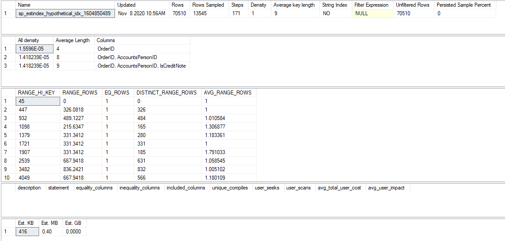

# sp_estindex


![Azure SQL](https://img.shields.io/badge/Azure%20SQL-vCurrent-blue?logo=data:image/svg+xml;base64,PHN2ZyBkYXRhLXNsdWctaWQ9InNxbC1kYXRhYmFzZS1ibHVlIiB4bWxucz0iaHR0cDovL3d3dy53My5vcmcvMjAwMC9zdmciIHZpZXdCb3g9IjAgMCA0OSA0OSI+DQogIDxwYXRoIGQ9Im02LjQwNDIxIDcuNDA0NDJ2MzQuMTk1NzhjMCAzLjUyNDMgNy44ODk2OSA2LjQ3NzIgMTcuNjgwMzkgNi40Nzcydi00MC42NzI5OHoiIGZpbGw9IiM4MDgwODAiLz4NCiAgPHBhdGggZD0ibTIzLjg5NDYgNDguMDc3NGguMjg1MmM5Ljc5MDcgMCAxNy42ODA0LTIuODU3NiAxNy42ODA0LTYuNDc3MnYtMzQuMTk1NzhoLTE3Ljk2NTZ6IiBmaWxsPSIjODA4MDgwIi8+DQogIDxwYXRoIGQ9Im0yMy43MDQzIDQ4LjA3NzloLjI4NTJjOS44ODU4IDAgMTcuOTY1Ni0yLjg1NzYgMTcuOTY1Ni02LjQ3NzJ2LTM0LjI5MTAxaC0xOC4xNTU3eiIgZmlsbD0iIzgwODA4MCIvPg0KICA8cGF0aCBkPSJtNDEuODU4NCA3LjQwNTUzYzAgMy41MjQzNy03Ljg4OTcgNi40NzcxNy0xNy42ODA1IDYuNDc3MTctOS43OTA3IDAtMTcuNjgwMzktMi44NTc2LTE3LjY4MDM5LTYuNDc3MTcgMC0zLjYxOTYgNy44ODk2OS02LjQ3NzE4NSAxNy42ODAzOS02LjQ3NzE4NSA5Ljc5MDggMCAxNy42ODA1IDIuOTUyODM1IDE3LjY4MDUgNi40NzcxODV6IiBmaWxsPSIjZmZmIi8+PHBhdGggZD0ibTM4LjI0ODEgNy4wMjM4YzAgMi4zODEzMi02LjI3MzcgNC4yODY0LTE0LjA2ODMgNC4yODY0cy0xNC4wNjgzLTEuOTA1MDgtMTQuMDY4My00LjI4NjQgNi4yNzM3LTQuMjg2MzcgMTQuMDY4My00LjI4NjM3IDE0LjA2ODMgMS45MDUwNSAxNC4wNjgzIDQuMjg2Mzd6IiBmaWxsPSIjODA4MDgwIi8+DQogIDxwYXRoIGQ9Im0zNS4zMDEzIDkuNTk1NjNjMS44MDYxLS43NjIwMiAyLjk0NjgtMS42MTkzIDIuOTQ2OC0yLjU3MTgzIDAtMi4zODEzMi02LjI3MzctNC4yODYzNy0xNC4wNjgzLTQuMjg2MzdzLTE0LjA2ODMgMS45MDUwNS0xNC4wNjgzIDQuMjg2MzdjMCAuOTUyNTMgMS4xNDA3IDEuOTA1MDYgMi45NDY3IDIuNTcxODMgMi41NjY1LTEuMDQ3NzggNi42NTQtMS42MTkzIDExLjEyMTYtMS42MTkzczguNTU1LjY2Njc3IDExLjEyMTUgMS42MTkzeiIgZmlsbD0iIzgwODA4MCIvPg0KICA8ZyBmaWxsPSIjZmZmIj4NCiAgICA8cGF0aCBkPSJtMTguNDc1MiAzMS4xMjJjMCAxLjA0NzgtLjM4MDMgMS45MDUxLTEuMTQwNyAyLjQ3NjYtLjc2MDUuNTcxNS0xLjgwNjEuODU3My0zLjIzMTkuODU3My0xLjE0MDcgMC0yLjA5MTMtLjE5MDUtMi44NTE3LS42NjY4di0yLjQ3NjZjLjg1NTUuNzYyMSAxLjkwMTEgMS4xNDMxIDIuOTQ2NyAxLjE0MzEuNDc1MyAwIC45NTA2LS4wOTUzIDEuMjM1OC0uMjg1OC4yODUxLS4xOTA1LjM4MDItLjQ3NjIuMzgwMi0uODU3MyAwLS4zODEtLjA5NTEtLjY2NjctLjM4MDItLjg1NzItLjI4NTItLjI4NTgtLjg1NTUtLjU3MTUtMS43MTEtLjk1MjYtMS43MTExLS43NjItMi41NjY2LTEuOTA1LTIuNTY2Ni0zLjIzODYgMC0xLjA0NzcuMzgwMy0xLjgwOTggMS4xNDA3LTIuMzgxMy43NjA1LS41NzE1IDEuNzExLS45NTI1IDIuOTQ2Ny0uOTUyNSAxLjA0NTcgMCAxLjk5NjIuMTkwNSAyLjc1NjcuNDc2M3YyLjM4MTNjLS43NjA1LS40NzYzLTEuNjE2LS43NjItMi41NjY1LS43NjItLjQ3NTMgMC0uODU1NS4wOTUyLTEuMTQwNy4yODU3cy0uMzgwMi40NzYzLS4zODAyLjg1NzMuMDk1LjY2NjguMzgwMi44NTczYy4xOTAxLjE5MDUuNjY1NC40NzYyIDEuNDI1OC44NTcyIDEuMDQ1Ni40NzYzIDEuODA2MS45NTI2IDIuMjgxNCAxLjUyNDEuMjg1MS4zODEuNDc1My45NTI1LjQ3NTMgMS43MTQ1eiIvPjxwYXRoIGQ9Im0yNy44ODY4IDI4Ljc0MTJjMC0xLjE0My0uMjg1Mi0yLjAwMDMtLjc2MDQtMi42NjcxLS40NzUzLS42NjY3LTEuMTQwNy0uOTUyNS0xLjk5NjItLjk1MjVzLTEuNjE2LjI4NTgtMi4wOTEzLjk1MjVjLS41NzAzLjY2NjgtLjc2MDQgMS41MjQxLS43NjA0IDIuNjY3MSAwIDEuMDQ3OC4yODUyIDIuMDAwMy43NjA0IDIuNjY3MS40NzUzLjY2NjggMS4yMzU4Ljk1MjUgMi4wOTEzLjk1MjVzMS41MjA5LS4yODU3IDIuMDkxMi0uOTUyNWMuMzgwMi0uNjY2OC42NjU0LTEuNTI0MS42NjU0LTIuNjY3MXptMi42NjE2LS4wOTUyYzAgMS4zMzM1LS4yODUyIDIuNDc2NS0uODU1NSAzLjQyOTEtLjU3MDQuOTUyNS0xLjQyNTkgMS42MTkzLTIuNTY2NSAyLjAwMDNsMy4yMzE5IDMuMDQ4MWgtMy4yMzE5bC0yLjI4MTQtMi41NzE5Yy0uOTUwNiAwLTEuOTAxMS0uMjg1Ny0yLjY2MTYtLjc2Mi0uNzYwNC0uNDc2My0xLjQyNTgtMS4xNDMtMS44MDYtMi4wMDAzLS40NzUzLS44NTczLS42NjU0LTEuODA5OC0uNjY1NC0yLjg1NzYgMC0xLjE0My4xOTAxLTIuMTkwOC42NjU0LTMuMTQzMy40NzUzLS45NTI2IDEuMTQwNi0xLjYxOTMgMS45OTYyLTIuMDk1Ni44NTU1LS40NzYzIDEuODA2LS43NjIgMi45NDY3LS43NjIgMS4wNDU2IDAgMS45OTYyLjE5MDUgMi43NTY2LjY2NjguODU1NS40NzYyIDEuNDI1OSAxLjE0MyAxLjkwMTEgMi4wMDAzLjM4MDMuOTUyNS41NzA0IDEuOTA1LjU3MDQgMy4wNDgxeiIvPjxwYXRoIGQ9Im0zOS4xMDM2IDM0LjI2NTNoLTYuNzQ5di0xMS4xNDQ2aDIuNTY2NnY5LjE0NDNoNC4xODI0eiIvPg0KICA8L2c+DQo8L3N2Zz4NCg==)
[](https://ci.appveyor.com/project/LowlyDBA/dba-multitool)

[](https://codecov.io/gh/LowlyDBA/dba-multitool)

* [Purpose](#purpose)
* [Arguments](#arguments)
* [Usage](#usage)
* [Output](#output)
* [Contributing](#contributing)
* [More](#more)

## Purpose

In complex environments, sometimes the best ways to create indexes aren't
the most obvious. Table size, underlying statistics, missing index
recommendations, fill factors, and uniqueness are just *some* of the
factors that need to be considered. But these can be difficult to
aggregate and experiment with since index creation has a very real
cost of time and compute power in large databases.

To make index planning easier, `sp_estindex` gives you statistics on
how an index would look without having to actually create it!

## Arguments

| Parameter | Type | Output | Description |
| --- | --- | --- | --- |
| @SchemaName | SYSNAME(128) | no | Target schema of the index's table. Default is 'dbo'. |
| @TableName | SYSNAME(128) | no | Target table for the index. Default is current database. |
| @DatabaseName | SYSNAME(128) | no | Target database of the index's table. |
| @IndexColumns | NVARCHAR(2048) | no | Comma separated list of key columns. |
| @IncludeColumns | NVARCHAR(2048) | no | Optional comma separated list of include columns. |
| @IsUnique | BIT | no | Whether or not the index is UNIQUE. Default is 0. |
| @Filter | NVARCHAR(2048) | no | Optional filter for the index. |
| @FillFactor | TINYINT | no | Optional fill factor for the index. Default is 100. |
| @Verbose | BIT | no | Show intermediate variables used in size calculations. Default is 0. |
| @SqlMajorVersion | TINYINT | no | For unit testing only. |

## Usage

```tsql
EXEC dbo.sp_estindex @SchemaName = 'dbo', @tableName = 'Marathon', @IndexColumns = 'racer_id, finish_time';
```

```tsql
EXEC dbo.sp_estindex @tableName = 'Marathon', @IndexColumns = 'racer_id, finish_time', @Filter = 'WHERE racer_id IS NOT NULL', @FillFactor = 90;
```

## Output

For `[Sales].[Invoices]` in WorldWideImporters:

*Note: There is no missing index match in this example,
so the penultimate result set is empty.*



## Contributing

Missing a feature? Found a bug? Open an [issue][issue] to get some :heart:

## More

Check out the other scripts in the [DBA MultiTool][tool].

[tool]: http://dba-multitool.org
[issue]: https://github.com/LowlyDBA/dba-multitool/issues
