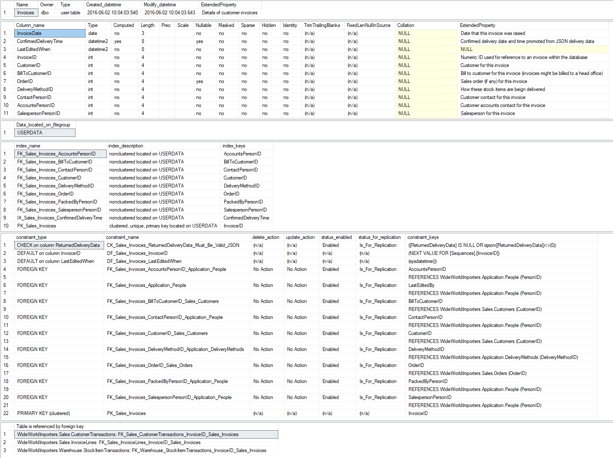

# sp_helpme


* [Purpose](#purpose)
* [Arguments](#arguments)
* [Usage](#usage)
* [Contributing](#contributing)
* [More](#more)

## Purpose

An drop-in modern alternative to sp_help.

Changes from the original include:

* Preferring printed messages over empty result sets for non-applicable data
* Including extended properties wherever possible
* Including create, modify, and more metadata about objects
* Referenced views are returned in two-part naming convention

## Arguments

| Parameter | Type | Output | Description |
| --- | --- | --- | --- |
| @ObjectName | SYSNAME(256) | no | Target object. Default is all objects. |
| @ExtendedPropertyName | SYSNAME(256) | no | Key for extended properties on objects. Default is 'Description'. |
| @SqlMajorVersion | TINYINT | no | Used for unit testing purposes only. |
| @SqlMinorVersion | SMALLINT | no | Used for unit testing purposes only. |

## Usage

Basic example:

```tsql
EXEC sp_helpme 'Sales.Invoices';
```

## Output

For `[Sales].[Invoices]` in WideWorldImporters:



## Contributing

Missing a feature? Found a bug? Open an [issue][issue] to get some :heart:

## More

Check out the other scripts in the [DBA MultiTool][tool].

<sub>*Icon made by [mangsaabguru](https://www.flaticon.com/authors/mangsaabguru)
from [www.flaticon.com](https://www.flaticon.com/)*</sub>

[tool]: http://dba-multitool.org
[issue]: https://github.com/LowlyDBA/dba-multitool/issues
