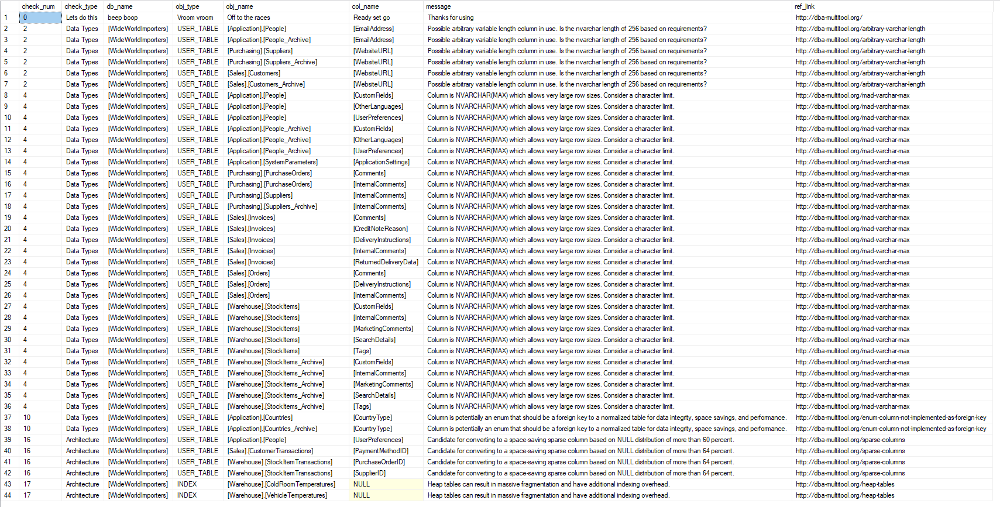

# sp_sizeoptimiser

* [Purpose](#purpose)
* [Arguments](#arguments)
* [Usage](#usage)
* [Output](#output)
* [Checks](#checks)
* [Contributing](#contributing)
* [More](#more)

## Purpose

A stored procedure that recommends space saving and corrective data
type measures based on SQL Server database schemas. Great for quickly
assessing databases that may have non-optimal data types. Especially
useful for SQL Server Express to help stay under the 10GB file size limitations.

Storage is cheap, but smaller is faster!

## Arguments

| Parameter | Type | Output | Description |
| --- | --- | --- | --- |
| @IndexNumThreshold | SMALLINT | no | Number of indexes to classify a table as having too many indexes on it. Default value is 10. |
| @IncludeDatabases | SIZEOPTIMISERTABLETYPE | no | Which databases to run the script on in the form of a user defined table type. If not supplied, all accessible user databases are targeted. Cannot be used in conjunction with @ExcludeDatabases. |
| @ExcludeDatabases | SIZEOPTIMISERTABLETYPE | no | Which databases to exclude in the form of a user defined table type. Cannot be used in conjunction with @IncludeDatabases. |
| @IncludeSysDatabases | BIT | no | Whether or not to include system databases in the script's analysis. Default is 0. |
| @IncludeSSRSDatabases | BIT | no | Whether or not to include SQL Server Reporting Services databases in the script's analysis. Default is 0. |
| @Verbose | BIT | no | Whether or not to print additional information during the script run. Default is 0. |
| @IsExpress | BIT | no | Used for unit testing purposes only. |
| @SqlMajorVersion | TINYINT | no | Used for unit testing purposes only. |
| @SqlMinorVersion | SMALLINT | no | Used for unit testing purposes only. |

## Usage

Basic example:

```tsql
DECLARE @includeDatabases SizeOptimiserTableType;

INSERT INTO @includeDatabases ([database_name])
VALUES (N'WideWorldImporters');

EXEC [dbo].[sp_sizeoptimiser] @IncludeDatabases = @includeDatabases;
GO
```

## Output

For WorldWideImporters:



## Checks

There are 17 checks currently supported:

### Data Types

* [Time based data types](#time-based-formats)
* [Arbitrary VARCHAR length](#arbitrary-varchar-length)
* [Unspecified VARCHAR length](#unspecified-varchar-length)
* [Mad VARCHAR Max](#mad-varchar-max)
* [NVARCHAR data type](#nvarchar-in-express) *(Express only)*
* [FLOAT and REAL data types](#float-and-real-data-types)
* [Deprecated data types](#deprecated-data-types)
* [BIGINT as IDENTITY](#bigint-as-identity) *(Express only)*
* [NUMERIC or DECIMAL with 0 scale](#numeric-or-decimal-0-scale)
* [Enum columns not implemented as foreign key](#enum-column-not-implemented-as-foreign-key)

### File Growth

* [Database growth past 10GB](#database-growth-past-10GB) *(Express only)*
* [Database growth type](#database-growth-type)

### Architecture

* [Default fill factor](#default-fill-factor) *(Express only)*
* [Number of indexes](#number-of-indexes)
* [Inefficient indexes](#inefficient-indexes)
* [Sparse columns](#sparse-columns)
* [Heap tables](#heap-tables)

----

#### Time based formats

Checks that commonly named time columns are using one of the
recommended date/time data types. Storing date/time data in
other data types may take up more storage and cause performance issues.

#### Arbitrary VARCHAR length

A variable length column should be based off of business requirements
and only be as large as the  maximum amount of data needed to be stored.
Using classic numbers like 256/255 to estimate the length of a column
usually indicate that the exact length required has not been properly assessed.

#### Unspecified VARCHAR length

If a [`VARCHAR`][char] column is created without specifying a length,
it defaults to one. If this is done by mistake, it may cause
truncation of data as it is inserted into the table.
If only one character is needed, `CHAR(1)` is
preferable as it uses 2 less bytes than `VARCHAR(1)`.

#### Mad VARCHAR Max

While using `VARCHAR(MAX)`/`NVARCHAR(MAX)` can be tempting as a one size
fits all solution, it is generally bad design practice unless absolutely
required. It limits the column's ability to be used as an index key,
makes online index rebuilding impossible, can lead to storing data pages
out of row, performance will generally suffer, and more.

#### NVARCHAR data type

With the database size limit of 10GB for user databases in SQL Server Express,
choosing the smallest data types is integral. Avoid NVARCHAR unless the
column requires Unicode data. Instead, VARCHAR will only use approximately
half of the space to store similar data.

#### FLOAT and REAL data types

While [`FLOAT` and `REAL`][float]
can store a precision up to 53, they inherently store approxmate data.
If stored values are required to be exact or are queried as `WHERE =`,
then inexact results may be returned.
[`DECIMAL` or `NUMERIC`][dec] should be chosen if exact values are
required and can fit in a precision of up to 38.
For more information, see Microsoft's [Using decimal, float, and real Data][use-float].

#### Deprecated data types

The use of [`NTEXT`, `TEXT`, and `IMAGE`][text] data types should be avoided.
These are deprecated data types and will be removed in future versions
of SQL Server. They can be replaced by [`NVARCHAR(MAX)`][nchar],
[`VARCHAR(MAX)`][char], and [`VARBINARY`][binary] data types.

#### BIGINT as IDENTITY

Each
[`BIGINT`][bigint] value requires 8 bytes of space and supports numbers
up to 2^63-1, but `INT` only requires 4 bytes with numbers up to 2^31-1.
Since each user database in SQL Server Express has a limit of 10GB, it
is unlikely that enough rows can exist to necessitate using `BIGINT`
as an `IDENTITY` data type. Defaulting to `INT` can save space and reflects
a more reasonable upper limit given the restrictions.

#### NUMERIC or DECIMAL with 0 scale

[`DECIMAL` or `NUMERIC`][dec] data types with a scale of 0
and precision of 18 or less are more effectively stored as an
[`INT` or `BIGINT`][bigint] due to their smaller sizes on disk
and ability to hold equivalent values.

#### Enum column not implemented as foreign key

Enumeration based columns should be implemented in a separate table
to adhere to [third normal form][tnf], which brings benefits of data
integrity, space savings, and performance increases. If these values
are instead stored in character data types directly in a table instead
of as a foreign key to said enumeration table, table size increases,
data integrity becomes much harder to maintain, and performance can suffer.

#### Database growth past 10GB

In most versions SQL Server Express, user databases and the model
database are subject to a limit of 10GB. Setting the file growth
limit to stay under that amount helps to prevent the database from
auto growing too large and being unable to function properly.

#### Database growth type

Setting data file growth to be a fixed value, versus a percentage,
helps to avoid exponential growth of the files. A percentage will
result in the file growing significantly larger over time during
each auto growth event.

#### Default fill factor

SQL Server defaults all table fill factors to 100%, but modifying it
to leave room for future data can greatly reduce the rate of
fragmentation for a table in certain situations. Due to size
limitations in SQL Server Express, however, changing this from the
default value can artificially increase file size and cause the
limit to be reached faster than desired. Fragmentation on small
data sets rarely results in performance issues, so keeping the
default fill factor is preferred for Express instances.

#### Number of indexes

While indexes should be added to complement key queries, too many
on a single table can hamper performance. There is no magic
number of how many indexes are too many, so this value is provided
as a parameter. The default value is 7.

#### Inefficient indexes

Indexes that are exact duplicates or overlap with others may
unnecessarily increase the storage footprint of a database.
These can reduce performance with little or no benefit to query
performance. Each index should be assessed based on the required
workload and only removed once it is determined it is not necessary.

#### Sparse columns

If [sparse columns][sparse] is an available feature and a column reaches the
[threshold percentage][threshold] of `NULL` values, significant space can be
optimized by converting the column to a sparse column. Statistics are used to
estimate the amount of `NULL` values so any suggestion should be validated
before implementing this advice.

#### Heap Tables

Heap tables cause an excessive amount of fragmentation when rows are inserted,
updated, or deleted from the table. This results in under utilized data pages,
adding additional I/O and causing table size to balloon. Most tables should have
a clustered index, unless they are used for staging data or temporary in nature.

## Contributing

Missing a feature? Found a bug? Open an [issue][issue] to get some :heart:

## More

Check out the other scripts in the [DBA MultiTool][tool].

[bigint]: https://docs.microsoft.com/en-us/sql/t-sql/data-types/int-bigint-smallint-and-tinyint-transact-sql?view=sql-server-2017
[binary]: https://docs.microsoft.com/en-us/sql/t-sql/data-types/binary-and-varbinary-transact-sql?view=sql-server-2017
[char]: https://docs.microsoft.com/en-us/sql/t-sql/data-types/char-and-varchar-transact-sql?view=sql-server-2017
[dec]: https://docs.microsoft.com/en-us/sql/t-sql/data-types/decimal-and-numeric-transact-sql?view=sql-server-2017
[tool]: http://dba-multitool.org
[float]: https://docs.microsoft.com/en-us/sql/t-sql/data-types/float-and-real-transact-sql?view=sql-server-2017
[issue]: https://github.com/LowlyDBA/dba-multitool/issues
[nchar]: https://docs.microsoft.com/en-us/sql/t-sql/data-types/nchar-and-nvarchar-transact-sql?view=sql-server-2017
[sparse]: https://docs.microsoft.com/en-us/sql/relational-databases/tables/use-sparse-columns?view=sql-server-2017
[text]: https://docs.microsoft.com/en-us/sql/t-sql/data-types/ntext-text-and-image-transact-sql?view=sql-server-2017
[threshold]: https://docs.microsoft.com/en-us/sql/relational-databases/tables/use-sparse-columns?view=sql-server-2017#estimated-space-savings-by-data-type
[tnf]: https://en.wikipedia.org/wiki/Third_normal_form
[use-float]: https://docs.microsoft.com/en-us/previous-versions/sql/sql-server-2008-r2/ms187912(v=sql.105)
