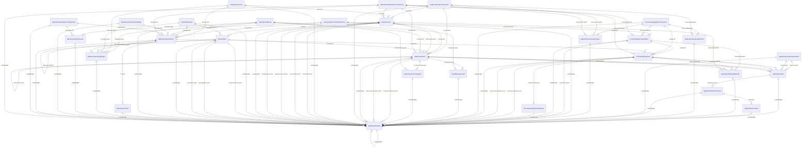

```mermaid
erDiagram
ApplicationCities ||--o{ ApplicationPeople : LastEditedBy
ApplicationCities ||--o{ ApplicationStateProvinces : StateProvinceID
ApplicationCountries ||--o{ ApplicationPeople : LastEditedBy
ApplicationDeliveryMethods ||--o{ ApplicationPeople : LastEditedBy
ApplicationPaymentMethods ||--o{ ApplicationPeople : LastEditedBy
ApplicationPeople ||--o{ ApplicationPeople : LastEditedBy
ApplicationStateProvinces ||--o{ ApplicationCountries : CountryID
ApplicationStateProvinces ||--o{ ApplicationPeople : LastEditedBy
ApplicationSystemParameters ||--o{ ApplicationCities : DeliveryCityID
ApplicationSystemParameters ||--o{ ApplicationCities : PostalCityID
ApplicationSystemParameters ||--o{ ApplicationPeople : LastEditedBy
ApplicationTransactionTypes ||--o{ ApplicationPeople : LastEditedBy
PurchasingPurchaseOrderLines ||--o{ ApplicationPeople : LastEditedBy
PurchasingPurchaseOrderLines ||--o{ PurchasingPurchaseOrders : PurchaseOrderID
PurchasingPurchaseOrderLines ||--o{ WarehousePackageTypes : PackageTypeID
PurchasingPurchaseOrderLines ||--o{ WarehouseStockItems : StockItemID
PurchasingPurchaseOrders ||--o{ ApplicationDeliveryMethods : DeliveryMethodID
PurchasingPurchaseOrders ||--o{ ApplicationPeople : ContactPersonID
PurchasingPurchaseOrders ||--o{ ApplicationPeople : LastEditedBy
PurchasingPurchaseOrders ||--o{ PurchasingSuppliers : SupplierID
PurchasingSupplierCategories ||--o{ ApplicationPeople : LastEditedBy
PurchasingSuppliers ||--o{ ApplicationCities : DeliveryCityID
PurchasingSuppliers ||--o{ ApplicationCities : PostalCityID
PurchasingSuppliers ||--o{ ApplicationDeliveryMethods : DeliveryMethodID
PurchasingSuppliers ||--o{ ApplicationPeople : PrimaryContactPersonID
PurchasingSuppliers ||--o{ ApplicationPeople : AlternateContactPersonID
PurchasingSuppliers ||--o{ ApplicationPeople : LastEditedBy
PurchasingSuppliers ||--o{ PurchasingSupplierCategories : SupplierCategoryID
PurchasingSupplierTransactions ||--o{ ApplicationPaymentMethods : PaymentMethodID
PurchasingSupplierTransactions ||--o{ ApplicationPeople : LastEditedBy
PurchasingSupplierTransactions ||--o{ ApplicationTransactionTypes : TransactionTypeID
PurchasingSupplierTransactions ||--o{ PurchasingPurchaseOrders : PurchaseOrderID
PurchasingSupplierTransactions ||--o{ PurchasingSuppliers : SupplierID
SalesBuyingGroups ||--o{ ApplicationPeople : LastEditedBy
SalesCustomerCategories ||--o{ ApplicationPeople : LastEditedBy
SalesCustomers ||--o{ ApplicationCities : DeliveryCityID
SalesCustomers ||--o{ ApplicationCities : PostalCityID
SalesCustomers ||--o{ ApplicationDeliveryMethods : DeliveryMethodID
SalesCustomers ||--o{ ApplicationPeople : PrimaryContactPersonID
SalesCustomers ||--o{ ApplicationPeople : AlternateContactPersonID
SalesCustomers ||--o{ ApplicationPeople : LastEditedBy
SalesCustomers ||--o{ SalesBuyingGroups : BuyingGroupID
SalesCustomers ||--o{ SalesCustomerCategories : CustomerCategoryID
SalesCustomers ||--o{ SalesCustomers : BillToCustomerID
SalesCustomerTransactions ||--o{ ApplicationPaymentMethods : PaymentMethodID
SalesCustomerTransactions ||--o{ ApplicationPeople : LastEditedBy
SalesCustomerTransactions ||--o{ ApplicationTransactionTypes : TransactionTypeID
SalesCustomerTransactions ||--o{ SalesCustomers : CustomerID
SalesCustomerTransactions ||--o{ SalesInvoices : InvoiceID
SalesInvoiceLines ||--o{ ApplicationPeople : LastEditedBy
SalesInvoiceLines ||--o{ SalesInvoices : InvoiceID
SalesInvoiceLines ||--o{ WarehousePackageTypes : PackageTypeID
SalesInvoiceLines ||--o{ WarehouseStockItems : StockItemID
SalesInvoices ||--o{ ApplicationDeliveryMethods : DeliveryMethodID
SalesInvoices ||--o{ ApplicationPeople : ContactPersonID
SalesInvoices ||--o{ ApplicationPeople : AccountsPersonID
SalesInvoices ||--o{ ApplicationPeople : SalespersonPersonID
SalesInvoices ||--o{ ApplicationPeople : PackedByPersonID
SalesInvoices ||--o{ ApplicationPeople : LastEditedBy
SalesInvoices ||--o{ SalesCustomers : CustomerID
SalesInvoices ||--o{ SalesCustomers : BillToCustomerID
SalesInvoices ||--o{ SalesOrders : OrderID
SalesOrderLines ||--o{ ApplicationPeople : LastEditedBy
SalesOrderLines ||--o{ SalesOrders : OrderID
SalesOrderLines ||--o{ WarehousePackageTypes : PackageTypeID
SalesOrderLines ||--o{ WarehouseStockItems : StockItemID
SalesOrders ||--o{ ApplicationPeople : SalespersonPersonID
SalesOrders ||--o{ ApplicationPeople : PickedByPersonID
SalesOrders ||--o{ ApplicationPeople : ContactPersonID
SalesOrders ||--o{ ApplicationPeople : LastEditedBy
SalesOrders ||--o{ SalesCustomers : CustomerID
SalesOrders ||--o{ SalesOrders : BackorderOrderID
SalesSpecialDeals ||--o{ ApplicationPeople : LastEditedBy
SalesSpecialDeals ||--o{ SalesBuyingGroups : BuyingGroupID
SalesSpecialDeals ||--o{ SalesCustomerCategories : CustomerCategoryID
SalesSpecialDeals ||--o{ SalesCustomers : CustomerID
SalesSpecialDeals ||--o{ WarehouseStockGroups : StockGroupID
SalesSpecialDeals ||--o{ WarehouseStockItems : StockItemID
WarehouseColors ||--o{ ApplicationPeople : LastEditedBy
WarehousePackageTypes ||--o{ ApplicationPeople : LastEditedBy
WarehouseStockGroups ||--o{ ApplicationPeople : LastEditedBy
WarehouseStockItemHoldings ||--o{ ApplicationPeople : LastEditedBy
WarehouseStockItemHoldings ||--o{ WarehouseStockItems : StockItemID
WarehouseStockItems ||--o{ ApplicationPeople : LastEditedBy
WarehouseStockItems ||--o{ PurchasingSuppliers : SupplierID
WarehouseStockItems ||--o{ WarehouseColors : ColorID
WarehouseStockItems ||--o{ WarehousePackageTypes : UnitPackageID
WarehouseStockItems ||--o{ WarehousePackageTypes : OuterPackageID
WarehouseStockItemStockGroups ||--o{ ApplicationPeople : LastEditedBy
WarehouseStockItemStockGroups ||--o{ WarehouseStockGroups : StockGroupID
WarehouseStockItemStockGroups ||--o{ WarehouseStockItems : StockItemID
WarehouseStockItemTransactions ||--o{ ApplicationPeople : LastEditedBy
WarehouseStockItemTransactions ||--o{ ApplicationTransactionTypes : TransactionTypeID
WarehouseStockItemTransactions ||--o{ PurchasingPurchaseOrders : PurchaseOrderID
WarehouseStockItemTransactions ||--o{ PurchasingSuppliers : SupplierID
WarehouseStockItemTransactions ||--o{ SalesCustomers : CustomerID
WarehouseStockItemTransactions ||--o{ SalesInvoices : InvoiceID
WarehouseStockItemTransactions ||--o{ WarehouseStockItems : StockItemID
```
