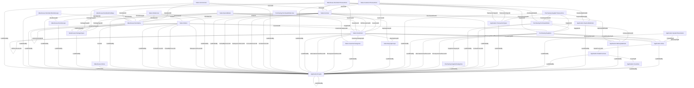

```mermaid
flowchart TD
Application.Cities---|LastEditedBy|Application.People
Application.Cities---|StateProvinceID|Application.StateProvinces
Application.Countries---|LastEditedBy|Application.People
Application.DeliveryMethods---|LastEditedBy|Application.People
Application.PaymentMethods---|LastEditedBy|Application.People
Application.People---|LastEditedBy|Application.People
Application.StateProvinces---|CountryID|Application.Countries
Application.StateProvinces---|LastEditedBy|Application.People
Application.SystemParameters---|DeliveryCityID|Application.Cities
Application.SystemParameters---|PostalCityID|Application.Cities
Application.SystemParameters---|LastEditedBy|Application.People
Application.TransactionTypes---|LastEditedBy|Application.People
Purchasing.PurchaseOrderLines---|LastEditedBy|Application.People
Purchasing.PurchaseOrderLines---|PurchaseOrderID|Purchasing.PurchaseOrders
Purchasing.PurchaseOrderLines---|PackageTypeID|Warehouse.PackageTypes
Purchasing.PurchaseOrderLines---|StockItemID|Warehouse.StockItems
Purchasing.PurchaseOrders---|DeliveryMethodID|Application.DeliveryMethods
Purchasing.PurchaseOrders---|ContactPersonID|Application.People
Purchasing.PurchaseOrders---|LastEditedBy|Application.People
Purchasing.PurchaseOrders---|SupplierID|Purchasing.Suppliers
Purchasing.SupplierCategories---|LastEditedBy|Application.People
Purchasing.Suppliers---|DeliveryCityID|Application.Cities
Purchasing.Suppliers---|PostalCityID|Application.Cities
Purchasing.Suppliers---|DeliveryMethodID|Application.DeliveryMethods
Purchasing.Suppliers---|PrimaryContactPersonID|Application.People
Purchasing.Suppliers---|AlternateContactPersonID|Application.People
Purchasing.Suppliers---|LastEditedBy|Application.People
Purchasing.Suppliers---|SupplierCategoryID|Purchasing.SupplierCategories
Purchasing.SupplierTransactions---|PaymentMethodID|Application.PaymentMethods
Purchasing.SupplierTransactions---|LastEditedBy|Application.People
Purchasing.SupplierTransactions---|TransactionTypeID|Application.TransactionTypes
Purchasing.SupplierTransactions---|PurchaseOrderID|Purchasing.PurchaseOrders
Purchasing.SupplierTransactions---|SupplierID|Purchasing.Suppliers
Sales.BuyingGroups---|LastEditedBy|Application.People
Sales.CustomerCategories---|LastEditedBy|Application.People
Sales.Customers---|DeliveryCityID|Application.Cities
Sales.Customers---|PostalCityID|Application.Cities
Sales.Customers---|DeliveryMethodID|Application.DeliveryMethods
Sales.Customers---|PrimaryContactPersonID|Application.People
Sales.Customers---|AlternateContactPersonID|Application.People
Sales.Customers---|LastEditedBy|Application.People
Sales.Customers---|BuyingGroupID|Sales.BuyingGroups
Sales.Customers---|CustomerCategoryID|Sales.CustomerCategories
Sales.Customers---|BillToCustomerID|Sales.Customers
Sales.CustomerTransactions---|PaymentMethodID|Application.PaymentMethods
Sales.CustomerTransactions---|LastEditedBy|Application.People
Sales.CustomerTransactions---|TransactionTypeID|Application.TransactionTypes
Sales.CustomerTransactions---|CustomerID|Sales.Customers
Sales.CustomerTransactions---|InvoiceID|Sales.Invoices
Sales.InvoiceLines---|LastEditedBy|Application.People
Sales.InvoiceLines---|InvoiceID|Sales.Invoices
Sales.InvoiceLines---|PackageTypeID|Warehouse.PackageTypes
Sales.InvoiceLines---|StockItemID|Warehouse.StockItems
Sales.Invoices---|DeliveryMethodID|Application.DeliveryMethods
Sales.Invoices---|ContactPersonID|Application.People
Sales.Invoices---|AccountsPersonID|Application.People
Sales.Invoices---|SalespersonPersonID|Application.People
Sales.Invoices---|PackedByPersonID|Application.People
Sales.Invoices---|LastEditedBy|Application.People
Sales.Invoices---|CustomerID|Sales.Customers
Sales.Invoices---|BillToCustomerID|Sales.Customers
Sales.Invoices---|OrderID|Sales.Orders
Sales.OrderLines---|LastEditedBy|Application.People
Sales.OrderLines---|OrderID|Sales.Orders
Sales.OrderLines---|PackageTypeID|Warehouse.PackageTypes
Sales.OrderLines---|StockItemID|Warehouse.StockItems
Sales.Orders---|SalespersonPersonID|Application.People
Sales.Orders---|PickedByPersonID|Application.People
Sales.Orders---|ContactPersonID|Application.People
Sales.Orders---|LastEditedBy|Application.People
Sales.Orders---|CustomerID|Sales.Customers
Sales.Orders---|BackorderOrderID|Sales.Orders
Sales.SpecialDeals---|LastEditedBy|Application.People
Sales.SpecialDeals---|BuyingGroupID|Sales.BuyingGroups
Sales.SpecialDeals---|CustomerCategoryID|Sales.CustomerCategories
Sales.SpecialDeals---|CustomerID|Sales.Customers
Sales.SpecialDeals---|StockGroupID|Warehouse.StockGroups
Sales.SpecialDeals---|StockItemID|Warehouse.StockItems
Warehouse.Colors---|LastEditedBy|Application.People
Warehouse.PackageTypes---|LastEditedBy|Application.People
Warehouse.StockGroups---|LastEditedBy|Application.People
Warehouse.StockItemHoldings---|LastEditedBy|Application.People
Warehouse.StockItemHoldings---|StockItemID|Warehouse.StockItems
Warehouse.StockItems---|LastEditedBy|Application.People
Warehouse.StockItems---|SupplierID|Purchasing.Suppliers
Warehouse.StockItems---|ColorID|Warehouse.Colors
Warehouse.StockItems---|UnitPackageID|Warehouse.PackageTypes
Warehouse.StockItems---|OuterPackageID|Warehouse.PackageTypes
Warehouse.StockItemStockGroups---|LastEditedBy|Application.People
Warehouse.StockItemStockGroups---|StockGroupID|Warehouse.StockGroups
Warehouse.StockItemStockGroups---|StockItemID|Warehouse.StockItems
Warehouse.StockItemTransactions---|LastEditedBy|Application.People
Warehouse.StockItemTransactions---|TransactionTypeID|Application.TransactionTypes
Warehouse.StockItemTransactions---|PurchaseOrderID|Purchasing.PurchaseOrders
Warehouse.StockItemTransactions---|SupplierID|Purchasing.Suppliers
Warehouse.StockItemTransactions---|CustomerID|Sales.Customers
Warehouse.StockItemTransactions---|InvoiceID|Sales.Invoices
Warehouse.StockItemTransactions---|StockItemID|Warehouse.StockItems
```
